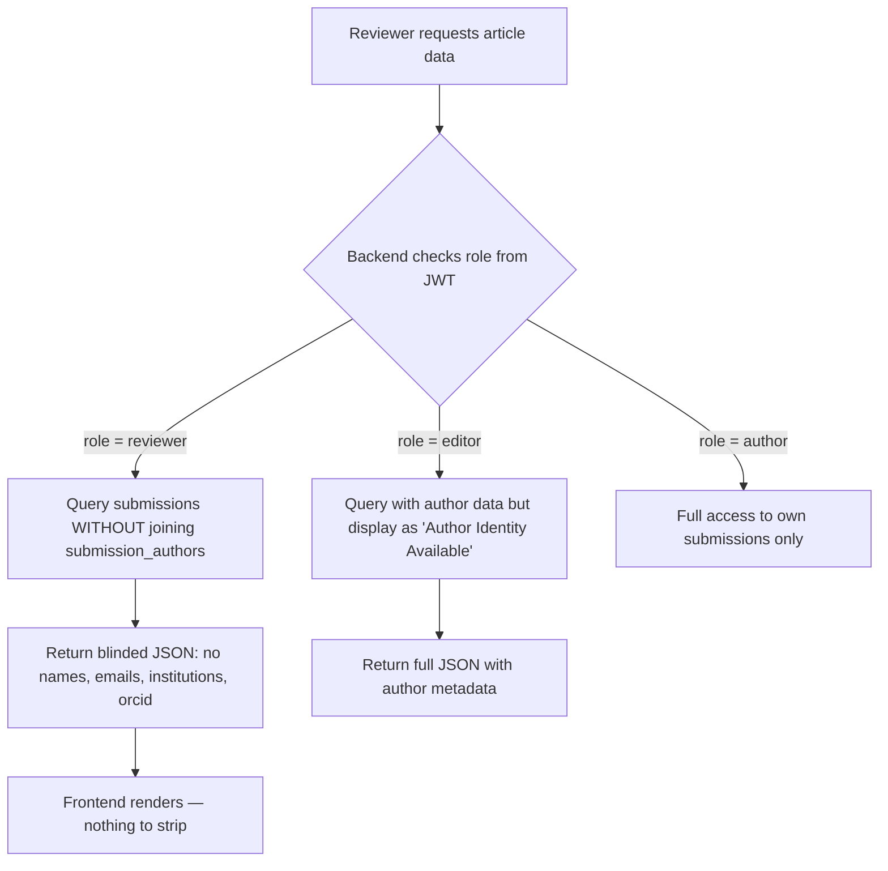

# 🏗️ DASHBOARD INTEGRATION PLAN
## UI-to-Backend Full Integration Strategy

> **Document Version:** 1.0  
> **Date:** July 20, 2026  
> **Author:** Principal Frontend Architect  
> **Status:** Pending Approval  
> **Codebase:** `poltemakademi/dergi` — Vite + React + TypeScript + Zustand + Supabase

---

## Table of Contents

1. [Current State Assessment](#1-current-state-assessment)
2. [Role-Based Action Mapping (RBAC)](#2-role-based-action-mapping-rbac)
3. [Core Business Logic Integration](#3-core-business-logic-integration)
4. [Feedback & Error Handling Mechanism](#4-feedback--error-handling-mechanism)
5. [Execution Roadmap](#5-execution-roadmap)

---

## 1. Current State Assessment

### What Exists Today

| Layer | Status | Notes |
|---|---|---|
| **Axios Client** | ✅ Configured | `src/services/api/client.ts` — JWT interceptor + 401 auto-logout working |
| **Auth Store** | ✅ Working | `useAuthStore` — Supabase session recovery, role persistence, `setAuth/logout/setActiveRole` |
| **Tenant Store** | ✅ Working | `useTenantStore` — Live Supabase queries with mock fallback for public journal pages |
| **Submission Store** | ✅ Working | `useSubmissionStore` — Wizard step management, metadata, authors, file state |
| **SSE/Notifications** | ⚠️ Partial | `useSSE` hook — Polling fallback active, SSE stream commented out |
| **Dashboard Guard** | ✅ Working | `DashboardGuard` — Auth gate + smart single/multi-role routing |
| **Profile Validation** | ✅ Working | `profileValidation.ts` — Role-specific field requirements |
| **Dashboard Pages** | ⚠️ Static | All 15 dashboard pages rendered with mock data fallbacks. API calls attempt real backend but silently fall back to hardcoded mock data on failure |

### Architecture: Dual Data Source Pattern

The current codebase employs a **"Try Real, Fallback Mock"** pattern across all dashboards:

```
API Call → Success? → Use real data
              ↓ No
         Use hardcoded mock arrays
```

> [!IMPORTANT]
> **This means every page already has `apiClient` calls wired up**, but they silently swallow errors and render stale mock data. The integration task is NOT about adding API calls from scratch — it's about **replacing mock fallbacks with proper error states**, **wiring button handlers to real mutations**, and **removing the illusion of functionality**.

### Database Schema (Supabase)

The live database includes the following tables that map directly to dashboard features:

| Table | Dashboard Usage |
|---|---|
| `submissions` | Author submissions, Editor article pool, Reviewer assignments |
| `submission_authors` | Co-author metadata (double-blind target) |
| `submission_status_history` | Manuscript tracker pipeline |
| `review_assignments` | Reviewer queue |
| `reviews` | Reviewer evaluation results |
| `revision_requests` | Revision required workflow |
| `issues` | Issue Studio composer |
| `issue_articles` | Issue ↔ Article junction |
| `profiles` | User profile management |
| `journal_members` | RBAC role-journal mapping |
| `messages` / `message_threads` | Safe Mail Hub |
| `blinding_tokens` | Double-blind anonymization tokens |
| `pages` | CMS content |
| `journals` | Tenant metadata |
| `announcements` | Journal announcements |

---

## 2. Role-Based Action Mapping (RBAC)

### 2.1 Shared Pages (All Roles)

---

#### 📄 `/dashboard/role-selector` → [RoleSelector.tsx](file:///c:/Users/iTaZz/Desktop/Dergi/src/pages/dashboard/RoleSelector.tsx)

| # | Interactive Element | Current State | Required Integration |
|---|---|---|---|
| 1 | **Workspace Card (×3)** — click to select | ⚠️ Uses hardcoded `mockWorkspaces` array | `GET /api/user/workspaces` → Fetch real `journal_members` entries joined with `journals` to build workspace cards dynamically. Each card should show the user's actual role in that journal + live pending counts |
| 2 | **`handleSelect()` navigation** | ✅ Working | Zustand `setActiveRole` + `setActiveTenant` + `navigate()` — already functional. No change needed |

**Required Backend Endpoint:**
```
GET /api/user/workspaces
Response: [{ id, role, tenantName, tenantSlug, pendingCount }]
```

**Zustand Mutation:** `setActiveRole(role)` + `setActiveTenant({ id, name, slug })` — already implemented.

---

#### 📄 `/dashboard/profile` → [Profile.tsx](file:///c:/Users/iTaZz/Desktop/Dergi/src/pages/dashboard/Profile.tsx)

| # | Interactive Element | Current State | Required Integration |
|---|---|---|---|
| 1 | **Profile Form (8 fields)**: name, email, phone, institution, department, title_field, orcid, bio | ✅ Two-way bound with `useState` | Already calls `GET /api/user/profile` on mount and `PUT /api/user/profile` on save |
| 2 | **"Save Profile" button** | ✅ Calls `apiClient.put('/api/user/profile')` | Working but falls back to local-only `updateUser()` on error. Remove mock fallback toast suffix `(Local MOCK)` once backend is stable |
| 3 | **Role-based required field indicators** (`*` markers) | ✅ Working | `isProfileComplete()` utility handles role-specific validation |

**Required Backend Endpoints (already called):**
```
GET  /api/user/profile       → Supabase: profiles.select('*').eq('user_id', uid)
PUT  /api/user/profile       → Supabase: profiles.upsert({ user_id, ...formData })
```

**Sonner Feedback:** ✅ Already implemented — `toast.success()` / `toast.error()` on save.

---

#### 📄 `/dashboard/messages` → [Messages.tsx](file:///c:/Users/iTaZz/Desktop/Dergi/src/pages/dashboard/Messages.tsx)

| # | Interactive Element | Current State | Required Integration |
|---|---|---|---|
| 1 | **Inbox / Sent / Starred sidebar buttons** | ❌ Non-functional (no filter logic) | Add `activeFolder` state. `GET /api/messages?folder=inbox\|sent\|starred`. Each folder filters the message list |
| 2 | **Search input** | ❌ Non-functional (no `onChange` handler) | Add debounced search: `GET /api/messages?search={query}`. Filter messages client-side or server-side |
| 3 | **Message list items** — click to read | ⚠️ Works visually (unread → read) | `PATCH /api/messages/:id/read` to persist read status server-side |
| 4 | **Compose button** → opens modal | ✅ Opens modal | Already functional |
| 5 | **Compose form (To dropdown, Subject, Body)** | ⚠️ Hardcoded recipient options | `GET /api/messages/recipients` → Populate dropdown dynamically based on role (editors, support, etc.) |
| 6 | **"Send" button in compose modal** | ⚠️ Calls API but falls back to local simulation | `POST /api/messages` — Remove the local simulation fallback. Show `toast.error()` on real failure |
| 7 | **Reply button** (reading pane) | ❌ Non-functional | Open compose modal pre-filled with `Re: {subject}`, original sender as recipient, quoted body |
| 8 | **Star button** (reading pane) | ❌ Non-functional | `PATCH /api/messages/:id/star` toggle |
| 9 | **Delete/Trash button** (reading pane) | ⚠️ Only clears `selectedMessage` locally | `DELETE /api/messages/:id` then remove from local state + `toast.success('Message deleted')` |

**Required Backend Endpoints:**
```
GET    /api/messages?folder=inbox&search=...
GET    /api/messages/recipients
POST   /api/messages
PATCH  /api/messages/:id/read
PATCH  /api/messages/:id/star
DELETE /api/messages/:id
```

**Double-Blind Constraint:** The backend MUST mask sender identities when `activeRole === 'reviewer'`. Display "Reviewer 1", "Reviewer 2" instead of real names. This is a **backend responsibility** — the frontend only renders what the API returns.

---

#### 📄 `/dashboard/activity` → [Activity.tsx](file:///c:/Users/iTaZz/Desktop/Dergi/src/pages/dashboard/Activity.tsx)

| # | Interactive Element | Current State | Required Integration |
|---|---|---|---|
| 1 | **All / Unread filter tabs** | ✅ Working (client-side filter) | No change needed |
| 2 | **"Mark all read" button** | ⚠️ Calls `markAllAsRead()` from `useSSE` | `PATCH /api/notifications/read-all` — already wired in `useSSE` hook |
| 3 | **"Clear History" button** | ⚠️ Calls `DELETE /api/notifications` | Already wired. Needs backend implementation |
| 4 | **Notification item click** → mark as read | ⚠️ Calls `markAsRead(id)` from `useSSE` | `PATCH /api/notifications/:id/read` — already wired |

**Required Backend Endpoints (already called from `useSSE`):**
```
GET    /api/notifications?limit=15
PATCH  /api/notifications/:id/read
PATCH  /api/notifications/read-all
DELETE /api/notifications
SSE    /api/notifications/stream  (currently commented out — enable when ready)
```

---

### 2.2 Editor Dashboard (`/dashboard/editor/*`)

---

#### 📄 `/dashboard/editor/overview` → [Overview.tsx](file:///c:/Users/iTaZz/Desktop/Dergi/src/pages/dashboard/editor/Overview.tsx)

| # | Interactive Element | Current State | Required Integration |
|---|---|---|---|
| 1 | **KPI Cards (×4)**: Total Submissions, Acceptance Rate, Avg Review Time, Total Downloads | ⚠️ Falls back to hardcoded stats | `GET /api/editor/analytics` — Return `{ totalSubmissions, acceptanceRate, avgReviewTime, totalDownloads, trends, velocity, distribution }`. Remove mock fallback object |
| 2 | **Velocity Bar Chart** (12 bars) | ⚠️ Uses mock `velocity` array | Render from `analytics.velocity` returned by the API |
| 3 | **Pipeline Distribution** (4 progress bars) | ⚠️ Uses mock `distribution` array | Render from `analytics.distribution` returned by the API |

> [!NOTE]  
> This page is **read-only**. No buttons or mutations — only data fetching.

**Required Backend Endpoint:**
```
GET /api/editor/analytics
Response: {
  totalSubmissions: string,
  acceptanceRate: string,
  avgReviewTime: string,
  totalDownloads: string,
  trends: { submissions: string, acceptance: string, reviewTime: string, downloads: string },
  velocity: number[],     // 12 monthly values
  distribution: Array<{ label: string, count: number, color: string, pct: number }>
}
```

---

#### 📄 `/dashboard/editor/articles` → [Articles.tsx](file:///c:/Users/iTaZz/Desktop/Dergi/src/pages/dashboard/editor/Articles.tsx)

| # | Interactive Element | Current State | Required Integration |
|---|---|---|---|
| 1 | **Search input** | ❌ Non-functional (no state binding) | Add `searchQuery` state + debounced `GET /api/editor/articles?search={query}&status={tab}`. Filter by ID or title |
| 2 | **"Filter" button** | ❌ Non-functional | Open a filter dropdown/popover with status checkboxes (`PENDING_PRE_CHECK`, `IN_REVIEW`, `REVISION_REQUIRED`, `ACCEPTED`). On apply: refetch with `?status=IN_REVIEW,ACCEPTED` |
| 3 | **Article row hover → title link** | ❌ No navigation | Navigate to a detail/action modal: assign reviewers, change status, view manuscript |
| 4 | **"⋮" (MoreVertical) action button per row** | ❌ Non-functional | Open a context menu with options: **Assign Reviewer**, **Send to Revision**, **Accept**, **Reject**, **View PDF**. Each triggers the appropriate `PATCH /api/editor/articles/:id/status` or `POST /api/editor/articles/:id/assign-reviewer` |
| 5 | **Prev / Next pagination buttons** | ❌ `disabled` always | Track `page` and `totalPages` state. `GET /api/editor/articles?page=N&limit=10`. Enable buttons based on current page |

**Required Backend Endpoints:**
```
GET   /api/editor/articles?status=...&search=...&page=N&limit=10
PATCH /api/editor/articles/:id/status     body: { status: 'ACCEPTED' }
POST  /api/editor/articles/:id/assign-reviewer  body: { reviewerId: uuid }
GET   /api/editor/reviewers               → List available reviewers for assignment dropdown
```

**Sonner Feedback (per action):**
- Assign Reviewer: `toast.loading('Assigning…')` → `toast.success('Reviewer assigned')`
- Status Change: `toast.success('Status updated to {newStatus}')`
- Error: `toast.error('Failed to update: {error.message}')`

---

#### 📄 `/dashboard/editor/issues` → [Issues.tsx](file:///c:/Users/iTaZz/Desktop/Dergi/src/pages/dashboard/editor/Issues.tsx)

| # | Interactive Element | Current State | Required Integration |
|---|---|---|---|
| 1 | **Accepted Articles cards** (left panel) | ⚠️ Falls back to mock array | `GET /api/editor/articles?status=ACCEPTED&not_in_issue=true` |
| 2 | **Drag-and-drop cards → TOC dropzone** | ❌ Non-functional (no DnD library) | Implement using `@dnd-kit/core` or native HTML5 drag API. On drop: add article ID to a local `issueArticles[]` state array |
| 3 | **"Upload Generic" dropzone** | ❌ Non-functional (no file input) | Add hidden `<input type="file" accept=".pdf">`. On change: store file in local state. Display filename |
| 4 | **"Upload Cover Image" dropzone** | ❌ Non-functional (no file input) | Same pattern — `accept=".jpg,.png"`. Store file reference |
| 5 | **"Publish Issue" button** | ⚠️ Simulates with `setTimeout` | `POST /api/editor/issues/create` with `multipart/form-data`: `{ articles: string[], genericPdf: File, coverImage: File, volume: string, issueNumber: string }`. Remove `setTimeout` simulation |
| 6 | **Table of Contents area** | ❌ Empty dropzone | Render dropped articles in order. Allow reorder via drag. Each item should have a "remove" (×) button |

**Required Backend Endpoints:**
```
GET  /api/editor/articles?status=ACCEPTED&not_in_issue=true
POST /api/editor/issues/create   (multipart/form-data)
```

**Sonner Feedback:**
- Publishing: `toast.loading('Publishing issue…')` → `toast.success('Issue published!')` / `toast.error('Publish failed')`
- File upload: `toast.success('File attached')`

---

#### 📄 `/dashboard/editor/settings` → [Settings.tsx](file:///c:/Users/iTaZz/Desktop/Dergi/src/pages/dashboard/editor/Settings.tsx)

| # | Interactive Element | Current State | Required Integration |
|---|---|---|---|
| 1 | **Journal Information form** (5 fields) | ⚠️ Hardcoded initial values | `GET /api/journal/settings` on mount → populate form with real data |
| 2 | **Integrations form** (2 fields) | ⚠️ Hardcoded initial values | Same endpoint |
| 3 | **"Save All Settings" button** | ⚠️ Calls `apiClient.put('/api/editor/settings')` but falls back to mock success | Remove mock fallback. Real `PUT /api/journal/settings` with all form fields |

**Required Backend Endpoints:**
```
GET /api/journal/settings       → journals.select('*').eq('id', activeTenant.id)
PUT /api/journal/settings       → journals.update({ ...settings }).eq('id', activeTenant.id)
```

---

### 2.3 Author Dashboard (`/dashboard/yazar/*`)

---

#### 📄 `/dashboard/yazar/submissions` → [Submissions.tsx](file:///c:/Users/iTaZz/Desktop/Dergi/src/pages/dashboard/author/Submissions.tsx)

| # | Interactive Element | Current State | Required Integration |
|---|---|---|---|
| 1 | **"New Submission" button** (Link) | ✅ Working | `<Link to="/dashboard/yazar/submit-wizard">` — already functional |
| 2 | **Back button** | ✅ Working | `navigate(-1)` — already functional |
| 3 | **Submission table rows** | ⚠️ Falls back to mock data | `GET /api/author/submissions` scoped to `user.id`. Remove mock fallback array |
| 4 | **"→" track button per row** | ✅ Working | `<Link to="/dashboard/yazar/track/${sub.id}">` — already functional |

**Required Backend Endpoint:**
```
GET /api/author/submissions
→ Supabase: submissions.select('*').eq('author_id', user.id).order('created_at', { ascending: false })
Response: [{ id, title, status, created_at }]
```

---

#### 📄 `/dashboard/yazar/submit-wizard` → [SubmitWizard.tsx](file:///c:/Users/iTaZz/Desktop/Dergi/src/pages/dashboard/author/SubmitWizard.tsx)

| # | Interactive Element | Current State | Required Integration |
|---|---|---|---|
| 1 | **Step 1: Metadata form** (6 fields: EN/TR titles, abstracts, keywords) | ✅ Two-way bound via `useSubmissionStore.updateMetadata()` | No API call needed here — cached in Zustand until final submit |
| 2 | **"Next Step" button** | ✅ Working | `nextStep()` from Zustand — already functional |
| 3 | **"Back" button** | ✅ Working | `prevStep()` from Zustand — already functional |
| 4 | **Step 2: "Add Author" button** | ✅ Working | Opens inline form, validates name+email, adds to `useSubmissionStore.addAuthor()` |
| 5 | **"Save Author" button** | ✅ Working | Local state mutation + `toast.error()` on missing fields |
| 6 | **"Cancel" button (author form)** | ✅ Working | Hides form |
| 7 | **Delete author button (🗑)** | ✅ Working | `removeAuthor(id)` — already functional |
| 8 | **Step 3: File upload dropzone** | ✅ Working | Hidden `<input type="file" accept=".pdf">`. Sets `selectedFile` + `setFileUploaded(true)` |
| 9 | **"Submit Manuscript" button** | ⚠️ Calls API but falls back to mock success | `POST /api/author/submit` with `multipart/form-data`. Payload: `{ file: PDF, metadata: JSON }`. **Remove mock fallback** — on real failure show `toast.error()` |

**Dual-Language Validation (Step 1 → Step 9 gate):**
```typescript
// Already implemented in handleComplete():
if (!metadata.titleEn || !metadata.titleTr || !metadata.abstractEn || !metadata.abstractTr) {
  toast.error('Please ensure all mandatory English and Turkish fields are filled.');
  return;
}
```

**Required Backend Endpoint:**
```
POST /api/author/submit  (multipart/form-data)
Body: { file: Blob, metadata: JSON string }
→ Backend creates: submissions row + submission_authors rows + stores PDF in Supabase Storage
```

---

#### 📄 `/dashboard/yazar/track/:id` → [Track.tsx](file:///c:/Users/iTaZz/Desktop/Dergi/src/pages/dashboard/author/Track.tsx)

| # | Interactive Element | Current State | Required Integration |
|---|---|---|---|
| 1 | **Pipeline Stepper** (4 steps visual) | ❌ Hardcoded `currentStep` based on mock ID | `GET /api/author/submissions/:id` → return `{ id, title, status, created_at, statusHistory[] }`. Derive `currentStep` from `status` field |
| 2 | **"Withdraw Manuscript" button** | ⚠️ Calls `POST /api/author/withdraw/:id` but falls back to mock | Remove mock fallback. On success: navigate away + `toast.success()`. On real error: `toast.error('Withdrawal failed')` |
| 3 | **Withdrawal Confirmation Dialog** | ⚠️ Uses `window.confirm()` | **Upgrade to custom modal** with Sonner toast or a styled `<dialog>` explaining consequences (reviewer tokens revoked, draft files archived). Show `toast.loading('Processing withdrawal…')` |
| 4 | **"Upload Revised PDF" button** (revision state) | ❌ Non-functional | Add hidden file input. On file select: `POST /api/author/revisions/:id` with `multipart/form-data`. On success: refetch submission status |
| 5 | **Back to Submissions link** | ✅ Working | `<Link to="/dashboard/yazar/submissions">` — already functional |

**Required Backend Endpoints:**
```
GET  /api/author/submissions/:id        → submission + statusHistory
POST /api/author/withdraw/:id           → Set status to WITHDRAWN, revoke blinding_tokens
POST /api/author/revisions/:id          → Upload revised PDF, set status back to PENDING_PRE_CHECK
```

---

### 2.4 Reviewer Dashboard (`/dashboard/reviewer/*`)

---

#### 📄 `/dashboard/reviewer/assigned` → [Assigned.tsx](file:///c:/Users/iTaZz/Desktop/Dergi/src/pages/dashboard/reviewer/Assigned.tsx)

| # | Interactive Element | Current State | Required Integration |
|---|---|---|---|
| 1 | **Assignment cards** (list of manuscripts) | ⚠️ Falls back to mock array | `GET /api/reviewer/assigned` scoped to `user.id`. Must return **blinded data only** — no author names/emails/institutions |
| 2 | **"Start Evaluation" button per card** | ✅ Working | `<Link to="/dashboard/reviewer/evaluate/${item.id}">` — already functional |
| 3 | **Deadline badge** | ⚠️ Hardcoded dates | API must return `deadline` field from `review_assignments` table |

**Required Backend Endpoint:**
```
GET /api/reviewer/assigned
→ review_assignments.select('*, submissions(id, title, created_at)')
   .eq('reviewer_id', user.id)
   .eq('status', 'assigned')
⚠️ CRITICAL: Do NOT join submission_authors. Strip all author metadata server-side.
Response: [{ id, title, deadline, status }]
```

---

#### 📄 `/dashboard/reviewer/evaluate/:id` → [Evaluate.tsx](file:///c:/Users/iTaZz/Desktop/Dergi/src/pages/dashboard/reviewer/Evaluate.tsx)

| # | Interactive Element | Current State | Required Integration |
|---|---|---|---|
| 1 | **PDF Viewer (left panel)** | ❌ Fake skeleton placeholder | Load actual blinded PDF: `GET /api/reviewer/article/:id/pdf` → render in `<iframe>` or `<embed>` or a PDF.js viewer. File must be the **blinded version** from Supabase Storage |
| 2 | **Double-Blind Shield badge** | ✅ Visual only | Purely decorative — confirms anonymization is active |
| 3 | **Originality score buttons (1-5)** | ✅ Working | Local state `scores.originality` — interactive |
| 4 | **Rigor score buttons (1-5)** | ✅ Working | Local state `scores.rigor` — interactive |
| 5 | **"Notes for Author" textarea** | ✅ Working | Local state `notesForAuthor` — interactive |
| 6 | **"Confidential Comments for Editor" textarea** | ✅ Working | Local state `confidentialNotes` — interactive |
| 7 | **"Final Recommendation" dropdown** (Accept / Revision / Reject) | ✅ Working | Local state `recommendation` — interactive |
| 8 | **"Save Draft" button** | ❌ Just navigates back (no draft save) | `PUT /api/reviewer/evaluate/:id/draft` — Save partial review without submitting. `toast.success('Draft saved')` |
| 9 | **"Submit Review" button** | ⚠️ Calls API but falls back to mock | `POST /api/reviewer/evaluate/:id` — Remove mock fallback. On validation fail: `toast.error('Please complete all scores')`. On success: `toast.success('Review submitted')` + navigate back |

**CRITICAL: Double-Blind Interceptor (already implemented but needs hardening):**

```typescript
// Current implementation in Evaluate.tsx (line 27-35):
const sanitizedData = { ...response.data };
delete sanitizedData.authors;
delete sanitizedData.authorNames;
delete sanitizedData.institutions;
delete sanitizedData.emails;
```

> [!WARNING]
> **This client-side sanitization is a SECONDARY defense only.** The backend MUST be the primary enforcer. The `GET /api/reviewer/article/:id` endpoint must **never include** `author_id`, `submission_authors`, `author_name`, `email`, or `institution` fields in the response when the requesting user has the `reviewer` role.

**Required Backend Endpoints:**
```
GET  /api/reviewer/article/:id          → Blinded article metadata (no author info)
GET  /api/reviewer/article/:id/pdf      → Blinded PDF file from Supabase Storage
PUT  /api/reviewer/evaluate/:id/draft   → Save partial review
POST /api/reviewer/evaluate/:id         → Submit final review
     Body: { scores: { originality, rigor }, notesForAuthor, confidentialNotes, recommendation }
```

---

### 2.5 Layout Editor Dashboard (`/dashboard/layout/*`)

---

#### 📄 `/dashboard/layout/queue` → [Queue.tsx](file:///c:/Users/iTaZz/Desktop/Dergi/src/pages/dashboard/layout/Queue.tsx)

| # | Interactive Element | Current State | Required Integration |
|---|---|---|---|
| 1 | **Production queue table** | ⚠️ Falls back to mock array | `GET /api/layout/queue` → Return submissions with `status = 'IN_COPYEDITING'` scoped to active tenant |
| 2 | **"Process →" button per row** | ⚠️ All link to same `/dashboard/layout/proofs` | Must pass the article ID: `<Link to="/dashboard/layout/proofs?articleId=${item.id}">` or use URL params `/dashboard/layout/proofs/${item.id}` |

**Required Backend Endpoint:**
```
GET /api/layout/queue
→ submissions.select('id, title, status, created_at')
   .eq('journal_id', activeTenant.id)
   .eq('status', 'IN_COPYEDITING')
   .order('created_at')
Response: [{ id, title, priority, date }]
```

---

#### 📄 `/dashboard/layout/proofs` → [Proofs.tsx](file:///c:/Users/iTaZz/Desktop/Dergi/src/pages/dashboard/layout/Proofs.tsx)

| # | Interactive Element | Current State | Required Integration |
|---|---|---|---|
| 1 | **Article metadata header** | ❌ Hardcoded `JMS-2025-015` | Read `articleId` from URL params. `GET /api/layout/article/:id` → Populate title, author, ID dynamically |
| 2 | **"Download Raw Source" button** | ❌ Non-functional | `GET /api/layout/article/:id/source` → Download the author's original PDF. Use `window.open()` or create a download link |
| 3 | **File upload dropzone** | ✅ Working | Hidden `<input type="file" accept=".pdf">` — sets `selectedFile` state |
| 4 | **"Preview Upload" button** | ❌ Non-functional | Open the selected PDF in a new tab using `URL.createObjectURL(selectedFile)` for client-side preview before uploading |
| 5 | **"Mark as READY_FOR_PRODUCTION" button** | ⚠️ Calls API but falls back to mock | `POST /api/layout/upload-proof` with `multipart/form-data: { file, articleId }`. Backend should update submission status to `READY_FOR_PRODUCTION`. Remove mock fallback |

**Required Backend Endpoints:**
```
GET  /api/layout/article/:id            → Article metadata
GET  /api/layout/article/:id/source     → Download original PDF
POST /api/layout/upload-proof           → Upload galley proof + update status to READY_FOR_PRODUCTION
     Body: multipart/form-data { file: PDF, articleId: uuid }
```

---

### 2.6 Super Admin Dashboard (`/dashboard/admin/*`)

> [!NOTE]
> The `super_admin` role is referenced in `DashboardGuard` (routes to `/dashboard/admin/system`) but **no admin pages exist yet**. This role will be addressed in a future phase. The route protection logic is already in place.

---

## 3. Core Business Logic Integration

### 3.1 Double-Blind Peer Review Anonymization

The double-blind protocol is the **most critical academic integrity requirement** in this platform. It must be enforced at multiple layers:

#### Layer 1: Backend Enforcement (PRIMARY — Non-negotiable)



**Backend rules for `GET /api/reviewer/article/:id`:**
1. **NEVER** join `submission_authors` table
2. **NEVER** include `author_id` field
3. **NEVER** return `author_name`, `email`, `institution`, or `orcid`
4. Return only: `id`, `title`, `abstract`, `keywords`, `status`, `pdf_url` (blinded PDF)

#### Layer 2: Frontend Interceptor (SECONDARY — Defense-in-depth)

Already implemented in [Evaluate.tsx](file:///c:/Users/iTaZz/Desktop/Dergi/src/pages/dashboard/reviewer/Evaluate.tsx#L27-L35):

```typescript
const sanitizedData = { ...response.data };
delete sanitizedData.authors;
delete sanitizedData.authorNames;
delete sanitizedData.institutions;
delete sanitizedData.emails;
```

**Enhancement Plan:**
Create a reusable utility function in `src/utils/blindingFilter.ts`:

```typescript
// src/utils/blindingFilter.ts
const BLINDED_FIELDS = [
  'authors', 'authorNames', 'author', 'author_id', 'author_name',
  'institutions', 'institution', 'emails', 'email',
  'orcid', 'orcid_id', 'affiliation', 'affiliations',
  'submission_authors', 'corresponding_author'
] as const;

export function applyBlindingFilter<T extends Record<string, any>>(data: T): Omit<T, typeof BLINDED_FIELDS[number]> {
  const sanitized = { ...data };
  for (const field of BLINDED_FIELDS) {
    delete (sanitized as any)[field];
  }
  return sanitized;
}
```

#### Layer 3: Blinding Tokens (Withdrawal Cascade)

The `blinding_tokens` table exists in the database. When a manuscript is **WITHDRAWN**:
1. Backend revokes all associated `blinding_tokens` (sets `revoked_at = NOW()`)
2. Any active reviewer sessions viewing that manuscript should be invalidated
3. Frontend should show a visual "Anonymization Tokens Revoked" confirmation in the withdrawal modal

#### Layer 4: Message Anonymization

When `activeRole === 'reviewer'`, the messages API must:
- Replace sender names with pseudonyms: "Editor", "System", "Author (Blinded)"
- Never expose author email addresses in message threads related to submissions under review

---

### 3.2 Data Fetching Strategy

#### Current Pattern (What We Have)

All dashboard pages currently use **raw `useEffect` + `useState`** for data fetching:

```typescript
const [data, setData] = useState<any[]>([]);
const [isLoading, setIsLoading] = useState(true);
const [error, setError] = useState<string | null>(null);

useEffect(() => {
  const fetchData = async () => {
    try {
      const response = await apiClient.get('/api/...');
      setData(response.data);
    } catch (err) {
      // Falls back to mock data (PROBLEM)
      setData(MOCK_DATA);
    } finally {
      setIsLoading(false);
    }
  };
  fetchData();
}, []);
```

#### Recommended Strategy: Custom `useApiQuery` Hook

Rather than introducing a heavy library (React Query / SWR) which would require a new dependency and wrapper setup, we will create a **lightweight custom hook** that standardizes the pattern already in use across all pages:

```typescript
// src/hooks/useApiQuery.ts
import { useState, useEffect, useCallback } from 'react';
import { apiClient } from '../services/api/client';

interface UseApiQueryOptions<T> {
  /** API endpoint path */
  url: string;
  /** Query parameters */
  params?: Record<string, any>;
  /** Whether to fetch immediately on mount */
  enabled?: boolean;
  /** Transform response data before setting state */
  transform?: (data: any) => T;
}

interface UseApiQueryResult<T> {
  data: T | null;
  isLoading: boolean;
  error: string | null;
  refetch: () => Promise<void>;
}

export function useApiQuery<T = any>(options: UseApiQueryOptions<T>): UseApiQueryResult<T> {
  const { url, params, enabled = true, transform } = options;
  const [data, setData] = useState<T | null>(null);
  const [isLoading, setIsLoading] = useState(true);
  const [error, setError] = useState<string | null>(null);

  const fetchData = useCallback(async () => {
    setIsLoading(true);
    setError(null);
    try {
      const response = await apiClient.get(url, { params });
      const result = transform ? transform(response.data) : response.data;
      setData(result);
    } catch (err: any) {
      const message = err.response?.data?.message || err.message || 'An unexpected error occurred';
      setError(message);
      setData(null); // DO NOT fall back to mock data
    } finally {
      setIsLoading(false);
    }
  }, [url, JSON.stringify(params)]);

  useEffect(() => {
    if (enabled) {
      fetchData();
    }
  }, [fetchData, enabled]);

  return { data, isLoading, error, refetch: fetchData };
}
```

**Benefits over current approach:**
- **No mock fallback** — errors are real errors
- **Standardized loading/error states** across all pages
- **`refetch()` method** for manual refresh after mutations
- **`enabled` flag** prevents fetching before dependencies are ready (eliminates race conditions)
- **`transform`** allows data shaping (e.g., applying blinding filter)

#### Mutation Pattern: Custom `useApiMutation` Hook

```typescript
// src/hooks/useApiMutation.ts
import { useState, useCallback } from 'react';
import { apiClient } from '../services/api/client';
import { toast } from 'sonner';

interface UseApiMutationOptions {
  method?: 'post' | 'put' | 'patch' | 'delete';
  onSuccess?: (data: any) => void;
  successMessage?: string;
  errorMessage?: string;
}

export function useApiMutation<TPayload = any>(
  url: string | ((payload: TPayload) => string),
  options: UseApiMutationOptions = {}
) {
  const { method = 'post', onSuccess, successMessage, errorMessage } = options;
  const [isLoading, setIsLoading] = useState(false);

  const mutate = useCallback(async (payload?: TPayload, config?: any) => {
    setIsLoading(true);
    const resolvedUrl = typeof url === 'function' ? url(payload as TPayload) : url;

    const toastId = toast.loading('Processing…');
    try {
      const response = await apiClient[method](resolvedUrl, payload, config);
      toast.success(successMessage || 'Operation successful', { id: toastId });
      onSuccess?.(response.data);
      return response.data;
    } catch (err: any) {
      const message = err.response?.data?.message || err.message || 'Operation failed';
      toast.error(errorMessage || message, { id: toastId });
      throw err;
    } finally {
      setIsLoading(false);
    }
  }, [url, method, onSuccess, successMessage, errorMessage]);

  return { mutate, isLoading };
}
```

**This ensures every mutation automatically gets:**
- `toast.loading()` on initiation
- `toast.success()` on completion
- `toast.error()` on failure
- Consistent `isLoading` state for disabling buttons

---

### 3.3 Route Protection Enhancement

The current `DashboardGuard` only checks `isAuthenticated`. We need **role-scoped route protection**:

```typescript
// Enhancement to src/components/DashboardGuard.tsx
// Add a new wrapper component:

// src/components/RoleGuard.tsx
export function RoleGuard({ allowedRoles, children }: { allowedRoles: Role[], children: React.ReactNode }) {
  const { activeRole } = useAuthStore();
  
  if (!activeRole || !allowedRoles.includes(activeRole)) {
    return <Navigate to="/dashboard/role-selector" replace />;
  }
  
  return <>{children}</>;
}
```

**Route usage:**
```tsx
<Route path="editor/overview" element={<RoleGuard allowedRoles={['editor', 'super_admin']}><EditorOverview /></RoleGuard>} />
<Route path="reviewer/assigned" element={<RoleGuard allowedRoles={['reviewer']}><ReviewerAssigned /></RoleGuard>} />
```

---

## 4. Feedback & Error Handling Mechanism

### 4.1 Sonner Notification Standard

**Library:** `sonner@2.0.7` (already installed)  
**Global Config:** Already set in [App.tsx](file:///c:/Users/iTaZz/Desktop/Dergi/src/App.tsx#L71):
```tsx
<Toaster position="bottom-center" richColors />
```

### 4.2 Button Click Feedback Matrix

Every interactive element MUST provide immediate visual feedback using this exact pattern:

| Action Type | On Click | On Success | On Error |
|---|---|---|---|
| **Data Mutation** (save, submit, publish, withdraw) | `toast.loading('Processing…')` + disable button + show spinner | `toast.success('Action completed', { id: toastId })` | `toast.error('Failed: {message}', { id: toastId })` |
| **Navigation** (links, route changes) | Instant — no toast needed | N/A | N/A |
| **Data Fetch** (page load, refetch) | Skeleton loader or `isLoading` state | Silent — data renders | Inline error banner with retry button |
| **File Upload** | `toast.loading('Uploading…')` + progress state | `toast.success('File uploaded')` | `toast.error('Upload failed: {message}')` |
| **Destructive Action** (delete, withdraw) | **Confirmation modal first** → then `toast.loading('Processing…')` | `toast.success('Completed')` + navigate away | `toast.error('Failed')` |
| **Filter/Search** | Debounce 300ms → show inline loading spinner | Silent — results render | `toast.error('Search failed')` only if API errors |

### 4.3 Error Display Strategy

```
API Error Types:
├── 400 Bad Request     → toast.error('Invalid request: {field validation details}')
├── 401 Unauthorized    → Auto-handled by Axios interceptor → logout + redirect to /auth
├── 403 Forbidden       → toast.error('You do not have permission for this action')
├── 404 Not Found       → Inline empty state: "Resource not found"
├── 409 Conflict        → toast.error('Conflict: {details}') — e.g., duplicate submission
├── 422 Validation      → toast.error('Validation error: {field}: {message}')
├── 429 Rate Limited    → toast.warning('Too many requests. Please wait…')
├── 500 Server Error    → toast.error('Server error. Please try again later.')
└── Network Error       → toast.error('Network unavailable. Check your connection.')
```

### 4.4 Loading State Components

Create reusable loading skeletons in `src/components/`:

| Component | Usage |
|---|---|
| `<TableSkeleton rows={5} cols={6} />` | Editor Articles, Author Submissions, Layout Queue |
| `<CardSkeleton count={4} />` | Overview KPIs, Assigned Queue |
| `<FormSkeleton fields={6} />` | Profile, Settings |
| `<InboxSkeleton />` | Messages |

---

## 5. Execution Roadmap

### Phase 0: Infrastructure (Day 1)

> [!IMPORTANT]
> These foundational items must be completed FIRST before touching any dashboard page.

- [ ] **0.1** Create `src/hooks/useApiQuery.ts` — standardized data fetching hook
- [ ] **0.2** Create `src/hooks/useApiMutation.ts` — standardized mutation hook with Sonner integration
- [ ] **0.3** Create `src/utils/blindingFilter.ts` — reusable double-blind sanitization utility
- [ ] **0.4** Create `src/components/RoleGuard.tsx` — role-scoped route protection wrapper
- [ ] **0.5** Create `src/components/skeletons/` — `TableSkeleton`, `CardSkeleton`, `FormSkeleton`
- [ ] **0.6** Update [App.tsx](file:///c:/Users/iTaZz/Desktop/Dergi/src/App.tsx) routes to wrap role-specific pages with `<RoleGuard>`
- [ ] **0.7** Verify `apiClient` interceptor handles all error codes gracefully (test 400, 403, 404, 500)

**Testing Checkpoint:**
```
✅ useApiQuery hook returns { data, isLoading, error, refetch } correctly
✅ useApiMutation hook triggers toast.loading → toast.success/error
✅ RoleGuard redirects unauthorized users to /dashboard/role-selector
✅ blindingFilter strips all PII fields from a test object
```

---

### Phase 1: Author Dashboard (Day 2)

> Start with Author because it has the most user-facing complexity and touches the full submission lifecycle.

- [ ] **1.1** Integrate [Submissions.tsx](file:///c:/Users/iTaZz/Desktop/Dergi/src/pages/dashboard/author/Submissions.tsx) — Replace mock fallback with `useApiQuery`. Wire real `GET /api/author/submissions`
- [ ] **1.2** Integrate [SubmitWizard.tsx](file:///c:/Users/iTaZz/Desktop/Dergi/src/pages/dashboard/author/SubmitWizard.tsx) — Replace `handleComplete()` mock fallback with real `useApiMutation`. Enforce dual-language validation
- [ ] **1.3** Integrate [Track.tsx](file:///c:/Users/iTaZz/Desktop/Dergi/src/pages/dashboard/author/Track.tsx) — Fetch real submission status. Wire "Withdraw" button to real API. Add "Upload Revised PDF" functionality
- [ ] **1.4** Add proper withdrawal confirmation modal (replace `window.confirm`)

**Testing Checkpoint:**
```
✅ Author sees ONLY their own submissions (scoped to user.id)
✅ Submit wizard creates a real submission in the database
✅ Dual-language validation blocks submission if TR/EN fields are empty
✅ Manuscript tracker shows correct pipeline position from real status
✅ Withdraw sets status to WITHDRAWN and navigates back
✅ Every button shows Sonner feedback (loading → success/error)
```

---

### Phase 2: Reviewer Dashboard (Day 3)

> Critical for double-blind enforcement testing.

- [ ] **2.1** Integrate [Assigned.tsx](file:///c:/Users/iTaZz/Desktop/Dergi/src/pages/dashboard/reviewer/Assigned.tsx) — Wire `useApiQuery` to `GET /api/reviewer/assigned`. Verify NO author data leaks
- [ ] **2.2** Integrate [Evaluate.tsx](file:///c:/Users/iTaZz/Desktop/Dergi/src/pages/dashboard/reviewer/Evaluate.tsx) — Apply `blindingFilter`. Wire real PDF viewer. Wire "Submit Review" to real API. Add "Save Draft" functionality
- [ ] **2.3** Test double-blind shield end-to-end: submit as Author → assign reviewer → view as Reviewer → confirm zero author leakage

**Testing Checkpoint:**
```
✅ Reviewer sees ONLY manuscripts assigned to them
✅ NO author name, email, institution, or ORCID visible anywhere
✅ PDF preview loads the blinded version
✅ Review submission creates a real review record
✅ Save Draft persists without submitting
✅ Sonner feedback on all interactive elements
```

---

### Phase 3: Editor Dashboard (Day 4-5)

> Most complex role with the most interactive elements.

- [ ] **3.1** Integrate [Overview.tsx](file:///c:/Users/iTaZz/Desktop/Dergi/src/pages/dashboard/editor/Overview.tsx) — Wire `useApiQuery` to real analytics endpoint
- [ ] **3.2** Integrate [Articles.tsx](file:///c:/Users/iTaZz/Desktop/Dergi/src/pages/dashboard/editor/Articles.tsx) — Wire search, filter, pagination, and row action menu (assign reviewer, change status)
- [ ] **3.3** Integrate [Issues.tsx](file:///c:/Users/iTaZz/Desktop/Dergi/src/pages/dashboard/editor/Issues.tsx) — Implement drag-and-drop, file uploads, publish issue
- [ ] **3.4** Integrate [Settings.tsx](file:///c:/Users/iTaZz/Desktop/Dergi/src/pages/dashboard/editor/Settings.tsx) — Fetch real settings on mount, save to real API

**Testing Checkpoint:**
```
✅ Analytics KPIs reflect real database aggregates
✅ Article table loads real submissions, search filters work, pagination works
✅ Action menu: Assign Reviewer / Accept / Reject / Send to Revision all trigger real API calls
✅ Issue composer accepts drag-and-drop articles + file uploads
✅ "Publish Issue" creates a real issue record with linked articles
✅ Settings form loads and saves real journal configuration
```

---

### Phase 4: Layout Editor Dashboard (Day 5)

- [ ] **4.1** Integrate [Queue.tsx](file:///c:/Users/iTaZz/Desktop/Dergi/src/pages/dashboard/layout/Queue.tsx) — Wire `useApiQuery` to `GET /api/layout/queue`. Fix "Process" links to pass article ID
- [ ] **4.2** Integrate [Proofs.tsx](file:///c:/Users/iTaZz/Desktop/Dergi/src/pages/dashboard/layout/Proofs.tsx) — Dynamic article loading from URL params. Wire download source, preview, and upload proof

**Testing Checkpoint:**
```
✅ Queue shows only IN_COPYEDITING submissions for the active tenant
✅ "Process" button navigates to the correct article's proof page
✅ "Download Raw Source" downloads the original PDF
✅ "Preview Upload" opens selected PDF in new tab
✅ "Mark as READY_FOR_PRODUCTION" uploads proof and updates status
```

---

### Phase 5: Shared Pages (Day 6)

- [ ] **5.1** Integrate [RoleSelector.tsx](file:///c:/Users/iTaZz/Desktop/Dergi/src/pages/dashboard/RoleSelector.tsx) — Replace mock workspaces with real `GET /api/user/workspaces`
- [ ] **5.2** Integrate [Messages.tsx](file:///c:/Users/iTaZz/Desktop/Dergi/src/pages/dashboard/Messages.tsx) — Wire folder navigation, search, reply, star, delete. Apply double-blind masking for reviewer role
- [ ] **5.3** Verify [Profile.tsx](file:///c:/Users/iTaZz/Desktop/Dergi/src/pages/dashboard/Profile.tsx) — Already mostly integrated. Remove `(Local MOCK)` toast suffixes
- [ ] **5.4** Verify [Activity.tsx](file:///c:/Users/iTaZz/Desktop/Dergi/src/pages/dashboard/Activity.tsx) — Already mostly integrated via `useSSE`. Enable SSE stream when backend supports it

**Testing Checkpoint:**
```
✅ Role Selector shows real journal memberships
✅ Messages: compose, send, receive, reply, star, delete all work
✅ Reviewer's message view masks sender identities
✅ Profile save persists to database
✅ Activity feed shows real notifications
```

---

### Phase 6: Cleanup & Hardening (Day 7)

- [ ] **6.1** Remove ALL mock fallback arrays from every dashboard page
- [ ] **6.2** Remove `(Local Mock)` and `(Local MOCK)` toast suffixes from every component
- [ ] **6.3** Remove `console.warn('Backend unavailable...')` fallback patterns
- [ ] **6.4** Run full TypeScript build: `npm run build` — zero errors
- [ ] **6.5** Audit every `any` type — replace with proper interfaces
- [ ] **6.6** Cross-role penetration test: log in as Reviewer → attempt to access Editor routes → verify redirect
- [ ] **6.7** Double-blind audit: search entire frontend codebase for any renderer that could expose author identity to reviewers

**Final Acceptance Criteria:**
```
✅ Every button produces Sonner feedback (no silent clicks)
✅ No mock data rendered anywhere — all data from live Supabase
✅ Role-scoped routes reject unauthorized access
✅ Double-blind shield verified at both API and UI layers
✅ TypeScript build passes with zero errors
✅ All forms validate before submission
```

---

## Appendix A: Complete API Endpoint Registry

| Method | Endpoint | Role | Dashboard Page |
|---|---|---|---|
| `GET` | `/api/user/workspaces` | All | RoleSelector |
| `GET` | `/api/user/profile` | All | Profile |
| `PUT` | `/api/user/profile` | All | Profile |
| `GET` | `/api/messages` | All | Messages |
| `POST` | `/api/messages` | All | Messages |
| `PATCH` | `/api/messages/:id/read` | All | Messages |
| `PATCH` | `/api/messages/:id/star` | All | Messages |
| `DELETE` | `/api/messages/:id` | All | Messages |
| `GET` | `/api/messages/recipients` | All | Messages |
| `GET` | `/api/notifications` | All | Activity |
| `PATCH` | `/api/notifications/:id/read` | All | Activity |
| `PATCH` | `/api/notifications/read-all` | All | Activity |
| `DELETE` | `/api/notifications` | All | Activity |
| `SSE` | `/api/notifications/stream` | All | Activity |
| `GET` | `/api/editor/analytics` | Editor | Overview |
| `GET` | `/api/editor/articles` | Editor | Articles |
| `PATCH` | `/api/editor/articles/:id/status` | Editor | Articles |
| `POST` | `/api/editor/articles/:id/assign-reviewer` | Editor | Articles |
| `GET` | `/api/editor/reviewers` | Editor | Articles |
| `GET` | `/api/editor/issues` | Editor | Issues |
| `POST` | `/api/editor/issues/create` | Editor | Issues |
| `GET` | `/api/journal/settings` | Editor | Settings |
| `PUT` | `/api/journal/settings` | Editor | Settings |
| `GET` | `/api/author/submissions` | Author | Submissions |
| `GET` | `/api/author/submissions/:id` | Author | Track |
| `POST` | `/api/author/submit` | Author | SubmitWizard |
| `POST` | `/api/author/withdraw/:id` | Author | Track |
| `POST` | `/api/author/revisions/:id` | Author | Track |
| `GET` | `/api/reviewer/assigned` | Reviewer | Assigned |
| `GET` | `/api/reviewer/article/:id` | Reviewer | Evaluate |
| `GET` | `/api/reviewer/article/:id/pdf` | Reviewer | Evaluate |
| `PUT` | `/api/reviewer/evaluate/:id/draft` | Reviewer | Evaluate |
| `POST` | `/api/reviewer/evaluate/:id` | Reviewer | Evaluate |
| `GET` | `/api/layout/queue` | Layout | Queue |
| `GET` | `/api/layout/article/:id` | Layout | Proofs |
| `GET` | `/api/layout/article/:id/source` | Layout | Proofs |
| `POST` | `/api/layout/upload-proof` | Layout | Proofs |

**Total: 35 endpoints** across 5 roles and 15 dashboard pages.

---

## Appendix B: New Files to Create

| File Path | Purpose |
|---|---|
| `src/hooks/useApiQuery.ts` | Standardized data fetching hook |
| `src/hooks/useApiMutation.ts` | Standardized mutation hook with Sonner |
| `src/utils/blindingFilter.ts` | Double-blind PII sanitization utility |
| `src/components/RoleGuard.tsx` | Role-scoped route protection |
| `src/components/skeletons/TableSkeleton.tsx` | Table loading skeleton |
| `src/components/skeletons/CardSkeleton.tsx` | Card loading skeleton |
| `src/components/skeletons/FormSkeleton.tsx` | Form loading skeleton |

---

## Appendix C: Files to Modify

| File | Changes |
|---|---|
| `src/App.tsx` | Wrap routes with `<RoleGuard>` |
| `src/pages/dashboard/RoleSelector.tsx` | Replace mock workspaces |
| `src/pages/dashboard/Profile.tsx` | Remove mock fallback toasts |
| `src/pages/dashboard/Messages.tsx` | Wire 6 non-functional buttons |
| `src/pages/dashboard/Activity.tsx` | Enable SSE when ready |
| `src/pages/dashboard/editor/Overview.tsx` | Remove mock analytics fallback |
| `src/pages/dashboard/editor/Articles.tsx` | Wire search, filter, pagination, action menu |
| `src/pages/dashboard/editor/Issues.tsx` | Implement DnD, file uploads, real publish |
| `src/pages/dashboard/editor/Settings.tsx` | Fetch real settings on mount |
| `src/pages/dashboard/author/Submissions.tsx` | Remove mock fallback |
| `src/pages/dashboard/author/SubmitWizard.tsx` | Remove mock submit fallback |
| `src/pages/dashboard/author/Track.tsx` | Fetch real status, wire revision upload |
| `src/pages/dashboard/reviewer/Assigned.tsx` | Remove mock fallback, verify blinding |
| `src/pages/dashboard/reviewer/Evaluate.tsx` | Wire PDF viewer, save draft, harden blinding |
| `src/pages/dashboard/layout/Queue.tsx` | Remove mock fallback, fix process links |
| `src/pages/dashboard/layout/Proofs.tsx` | Dynamic article loading, wire all buttons |

**Total: 7 new files + 16 modified files**
